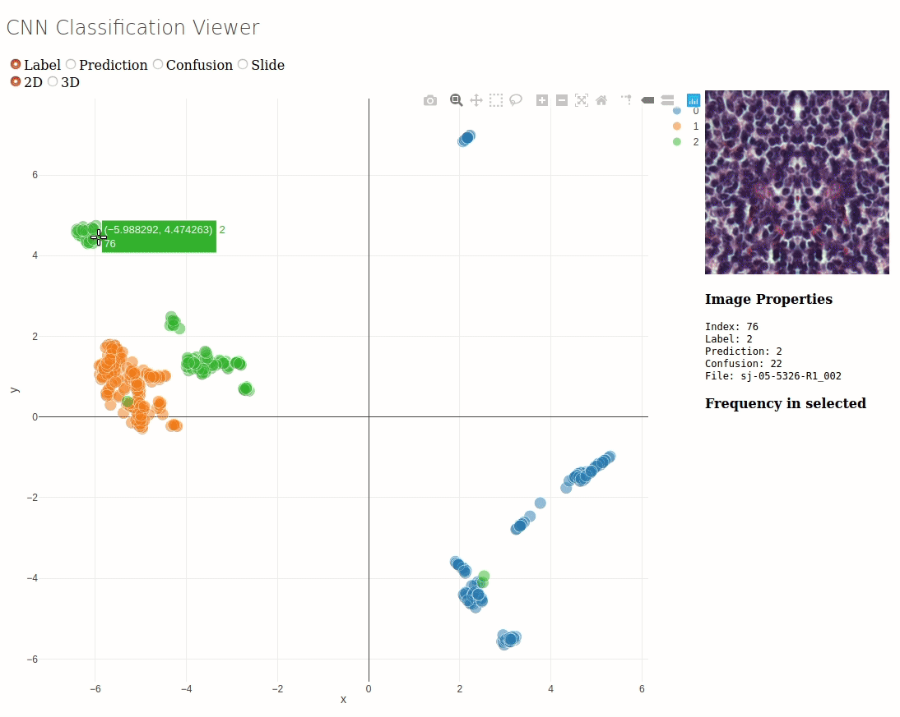

# CNN Classification Viewer
Dash plotly server for visualizing the decision boundrary of a DenseNet (or general CNN with adapdation) classifier and to easily visualize miss-classified pathes by the network. This aim of this tool is to help find tweaks on the input data resulting in better classification performance.

## Requirements
The code expects a cuda capable GPU as for each image a foreward pass has to be made.

The used Database backend expects a hdf5 file with the following tables:
  * root.imgs containing the image patches. 
  * root.label containing the ground truth.
  * root.fname containing the patch origin.
 
 
 ## Usage
 
Upon first exection a csv file of the embedding will be created. 
By setting the flag --load_from_file the embedding will be read from the csv file and no embedding and classification will be done.
 
 ~~~~
 usage: cnn_classification_viewer.py [-h] [--load_from_file]
                                 [--target_class TARGET_CLASS] [--port PORT]
                                 database filename model

Run a server for visualization of a CNN classifier

positional arguments:
  database              Database containing image patches, labels ...
  filename              Creates a csv file of the embedding
  model                 Saved torch model dict, and architecture

optional arguments:
  -h, --help            show this help message and exit
  --load_from_file, -l  Load the embedding from a csv file. Does not compute
                        the embedding
  --target_class TARGET_CLASS, -t TARGET_CLASS
                        Target Label, if the classifier was trained in one vs
                        all fashion
  --port PORT, -p PORT  Server Port
  ~~~~
## Example
 run example as  `python cnn_classification_viewer.py ./lymphoma.pytable ./filename.csv ./lymphoma_densenet_best_model.pth`.
 After first run is completed. It can be reloaded faster by using `python cnn_classification_viewer.py -l ./lymphoma.pytable ./filename.csv ./lymphoma_densenet_best_model.pth`
 
 The example was trained according to the blog post from Andrew Janowczyk: http://www.andrewjanowczyk.com/digital-pathology-classification-using-pytorch-densenet/.
 
 The example database consists of a smaller version of the validation dataset used in training the classifier because of github restrictions.
 
 ## Demo
 
 
 ## Future Plans
 * Upload example DenseNet and Database
 * rework program flow concering the file_handling and comand line input, so that only loading from file the model does not need to be specified.
 * create confusion map. target_class is ignored at the moment.
 
 
 
